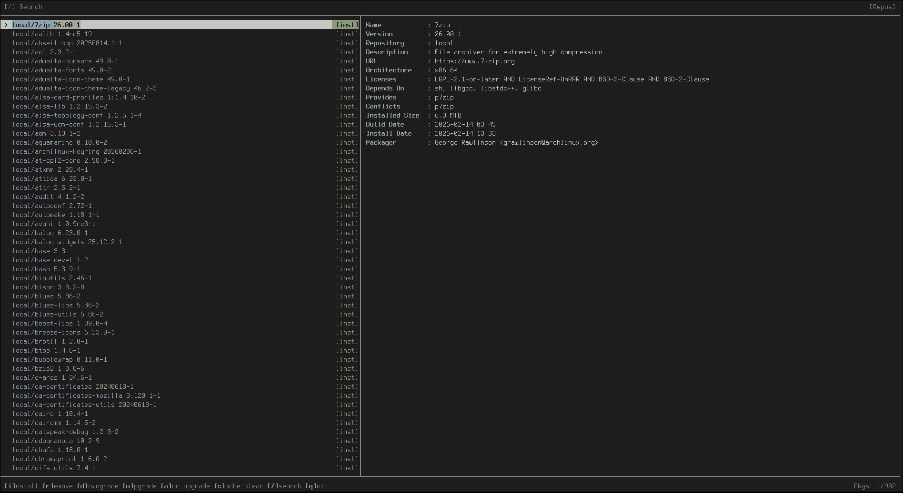

# pmt 

What is pmt?
>pmt is a tui for arch linux that handles both pacman and aur packages.

# Installation
```
sudo pacman -S --needed base-devel
git clone https://github.com/aethstetic/pmt.git                                                                                                                                                                                            
cd pmt                                          
makepkg -si  
```

# Features
The current features of pmt are:
```
Installing packages through pacman and aur
Upgrading system packages and aur packages
Downgrading to cached version
PKGBUILD diff review against previously reviewed version
Split package support via pkgbase
Auto-scrolling build log with elapsed timer
```

# Information 

pmt may require sudo to properly install packages. 

Pressing tab will switch between the standard pacman repo and aur.

pmt also features a few customization arguments such as: 
`--disable-color`
`--accent "#d3bd97"`

# Showcase 

